# Scythe 組立説明書

## 組み立ての前に
* はんだごてや工具、部品等でのケガに注意してください。
* 作業中に席を離れるときは、はんだごての電源を確認してください。
* 非常に小さい部品が含まれていますので、失くさないように注意してください。

## 内容物の確認
キットには以下の部品が含まれています。作業前に不足がないか確認してください。

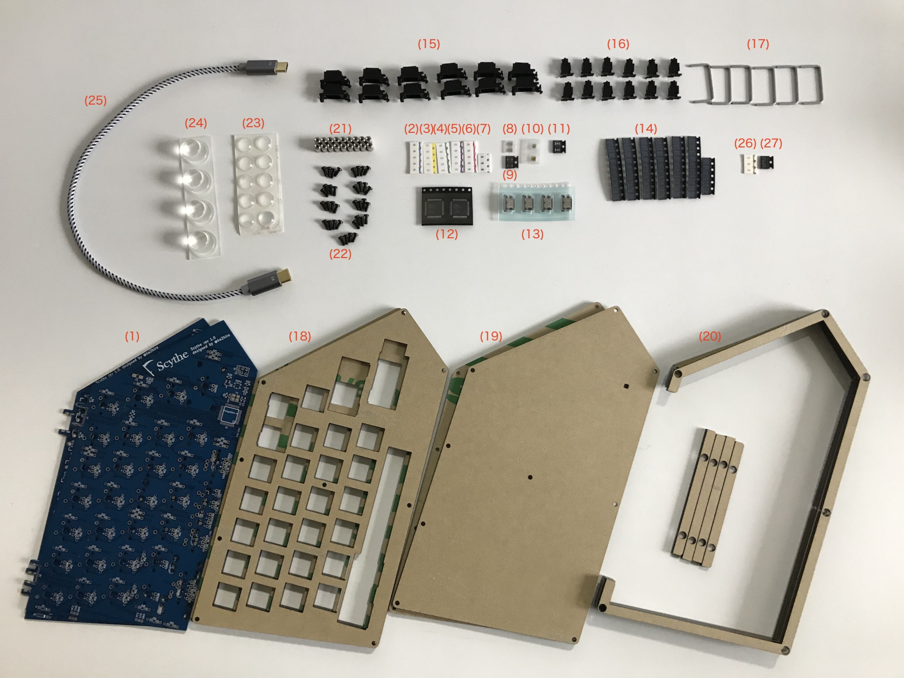

番号 | 名前      | 値     | 個数 | 備考                | 部品番号（左手側） | 部品番号（右手側） |
:----|:--------|:-----|:----|:-----------------|:-------|:-------
1  | PCB      |       | 2    | 左右1枚ずつ         | |
2  | コンデンサ | 1μF | 5   | 予備1、青マーカ、色が濃い | C1, C2 | C1, C2 |
3  | 抵抗      | 22Ω   | 5    | 予備1、黄マーカ、部品本体に"220"という表記あり | R3, R4 | R1, R2 |
4  | 抵抗      | 10kΩ  | 5    | 予備1、緑マーカ、部品本体に"103"という表記あり | R5, R38 | R3, R38 |
5  | 抵抗      | 5.1kΩ  | 5    | 予備1、紫マーカ、部品本体に"512"という表記あり | R1, R2 | R41, R42 |
6  | コンデンサ | 22pF  | 5 | 予備1、赤マーカ、色が薄い | C4, C5 | C4, C5 |
7  | コンデンサ | 0.1μF | 3 | 予備1、マーカなし    | C3 | C3 |
8  | 水晶発振子 | FA238-16MHz | 2 |                  | Y1 | Y1 |
9  | ショットキーダイオード | RB160M-30TR      | 2 |                  | D33 | D76 | 
10 | タクトスイッチ | TVAF17-WEC-R | 2 |                  | SW41 | SW44 | 
11 | ポリスイッチ | nanoSMDC050F/13.2 | 2 |                   | F1 | F1 |
12  | MPU      | ATMEGA32U4-AU | 2 |              | U1 | U1 |
13  | USBコネクタ | Type-C メス | 4 |           | J1, J2 | J1, J2 |
14 | ダイオード | 1N4148W | 66 |               | D1 - D32 | D1 - D33 |
15 | スタビライザ台座 |    | 12 |                 |
16 | スタビライザ軸 |     | 12 |                 |
17 | スタビライザワイヤ |     | 6 |                 |
18 | トッププレート |     | 2 |                 |
19 | ボトムプレート |     | 2 |                 |
20 | ミドルプレート |     | 4 |                 |
21 | M2スペーサ | 6mm | 18 |                   |
22 | M2ネジ    | 5mm | 36 |                   |
23 | ゴム足（小）       |      | 10 |                |
24 | ゴム足（大）       |      | 4 |                |
25 | USB Type-Cケーブル  |       | 1 | キーボード間接続用 |
26 | 抵抗      | 1kΩ  | 3    | バックライト用オプション、予備1、茶マーカ、部品本体に"102"という表記あり | R39 | R37 |
27 | FET  | IRLML6344TRPBFTR | 3 | バックライト用オプション | Q1 | Q1 |

## その他に必要なもの
キットを完成させるためには、以下の部品を別途用意する必要があります。

* キースイッチ（Cherry MX互換スイッチ）
* キーキャップ
* USB Type-C ケーブル（PCとの接続用）

オプションのバックライトをつける場合は、以下のパーツを別途用意する必要があります。

* 抵抗470Ω x 65（リード部品の場合は小さめ(<=2mm)、表面実装部品の場合は2012または1608 (mm)）
* 3mm LED x 65

オプションのアンダーグロウをつける場合は、以下のパーツを別途用意する必要があります。

* WS2812B LED テープ

## 作業に必要な工具
組立作業には、最低限以下の工具が必要となります。

* はんだごて（温度調節できるものが望ましい）
* はんだ
* ピンセット
* プラス(+)ドライバ
* ルーペ
* フラックス
* テスタ

その他、必要に応じて以下も用意すると良いです。

* フラックス洗浄剤
* はんだ吸取線または吸取機

## MPUをつける
1. MPU上に付いている●印と、基板上の○印を合わせて配置します。
2. 4方向全てのピンがパッド上に乗っていることを確認し、はんだ付けします。

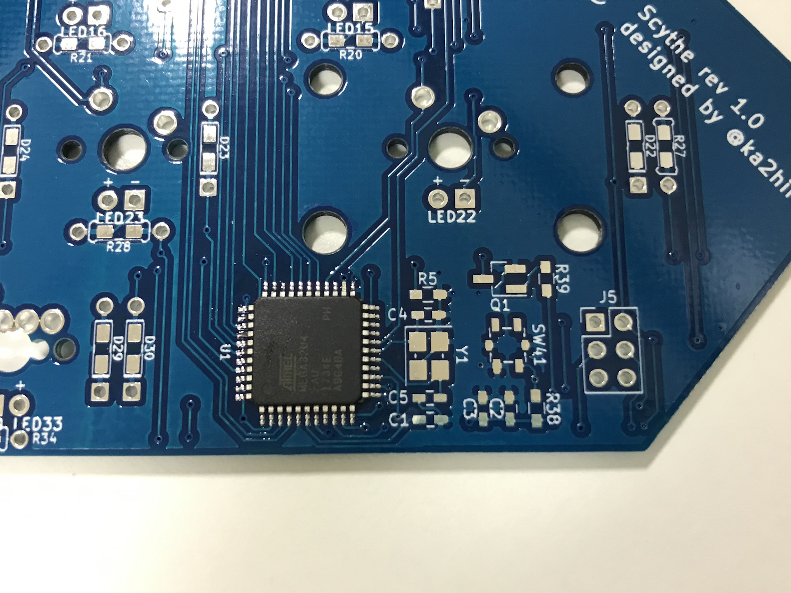

QFPパッケージのはんだ付けは、この[動画](https://www.youtube.com/watch?v=-8SRkSjkZ8A)が参考になるかもしれません。

## 水晶発振子をつける
1. 水晶発振子の長辺（どちらの長辺でも構いません）が、基板上の部品番号(Y1)の位置に来るように向きを合わせ、4つのパッドの中心に配置します。
2. 水晶発振子の角に少しだけ端子部分が見えるので、そこをこて先で温めつつはんだを流し込みます。

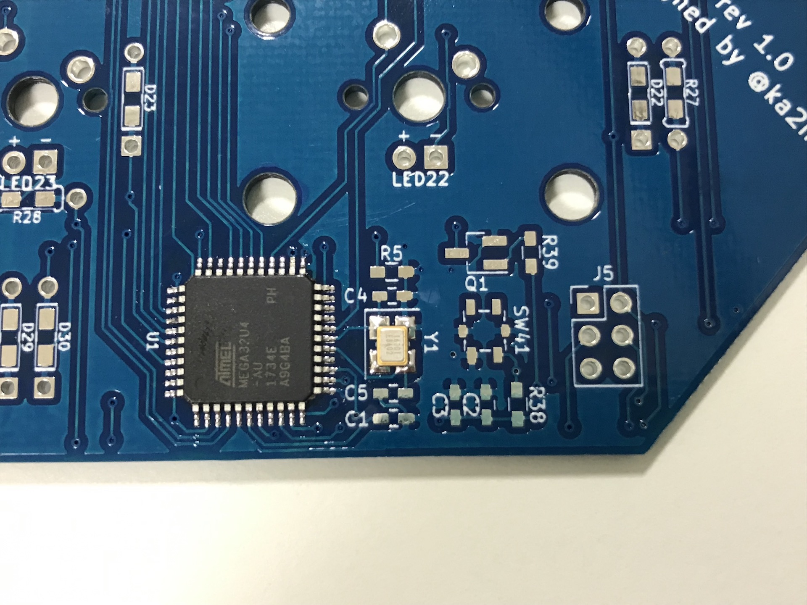

SMDタイプの水晶発振子のはんだ付けは、この[動画](https://www.youtube.com/watch?v=14fJTgFg03M)が参考になるかもしれません。

## 抵抗をつける
1. 抵抗 （左手側R1〜R5,R38、右手側R1〜R3,R37,R38,R41,R42） を取り付けます。部品が本当に小さいのであっという間に見失ってしまいますので、注意してください。作業するときは一度に一つずつ、テープから取り出してください。

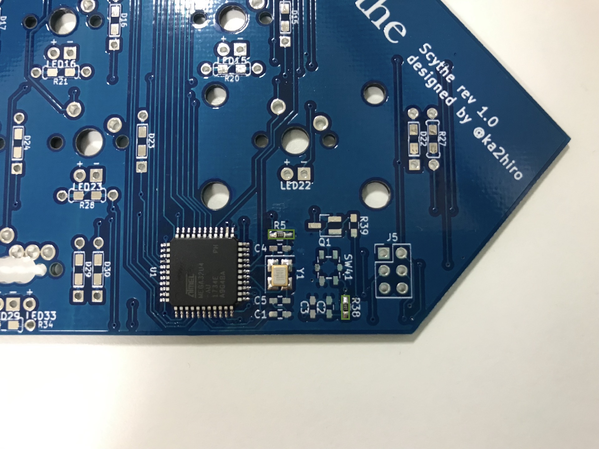
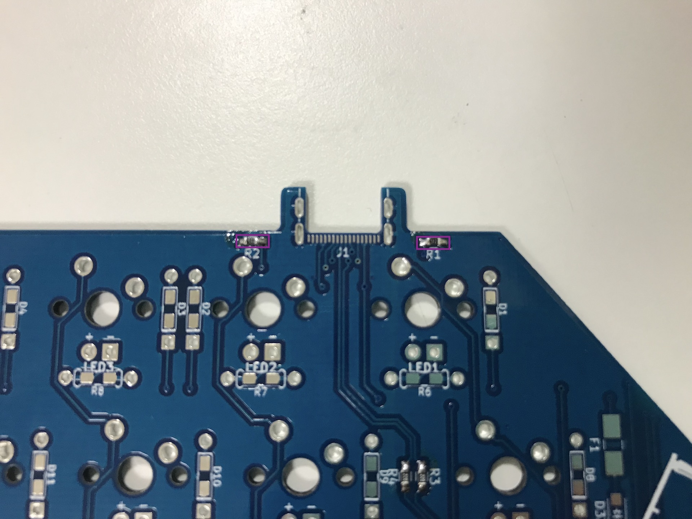

## コンデンサをつける
1. コンデンサ C1 〜 C5 を取り付けます。部品自体に数値や文字が書かれていないので、値の異なるものを混在させると見た目では識別できなくなります。作業するときは一度に一つずつ、テープから取り出してください。

## ショットキーダイオードをける
1. ダイオード（左手側D33、右手側D79）には取り付ける向きがあります。パッケージの片方が白く帯状に塗られている部分を、基板上のダイオードの記号の縦棒の位置に合わせてください。

## ポリスイッチをつける
1. ポリスイッチF1を取り付けます。

## USBコネクタをつける
1. 外側のスルーホール部分ではなく、先に端子部分からはんだ付けするとズレることなく取り付けできます。端子とパッドにたっぷりとフラックスを塗り、ごく少量のはんだを予めコテ先にのせておき、端子に軽く触れる感じでやるとうまくいきます。
2. ブリッジした場合は、きれいにしたコテ先で余分なはんだを掻き出すようにします。
3. _スルーホール部分の半田付けを忘れないようにしてください。_

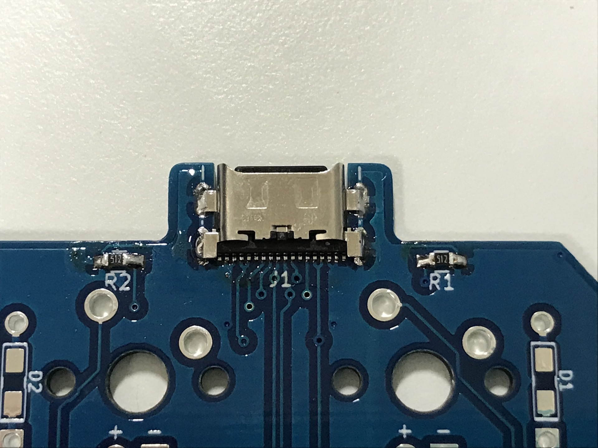

## タクトスイッチをつける
1. タクトスイッチは、4本の端子以外にも側面に端子があるので、先にパッドに薄く予備はんだをしておくといいでしょう。

## ダイオードをつける
1. ダイオード（右手側D1〜D32、左手側D1〜D33）を取り付けます。ダイオードには向きがあります。パッケージの片側に白くラインが入っている方を、基板上の四角いランドの方へ向けて取り付けます。

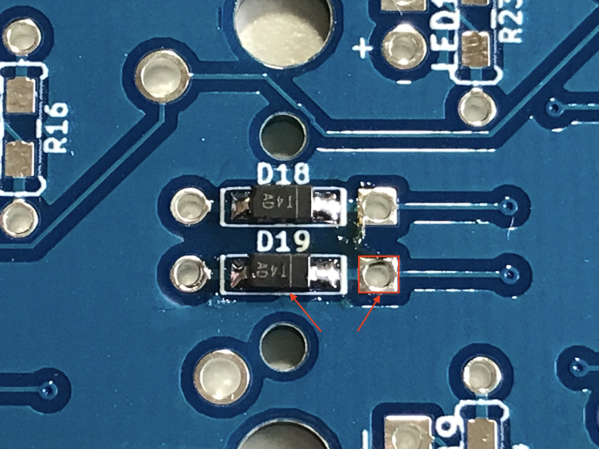

## バックライト用のFETをつける（オプション）
1. FET Q1を取り付けます。
2. すぐそばにある、抵抗（左手側R39、右手側R37）を取り付けます。
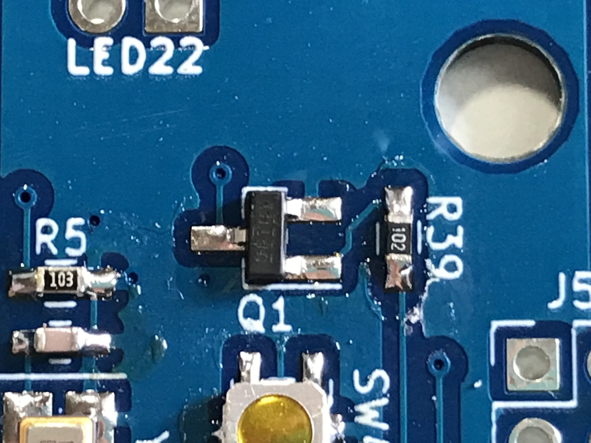
	
## バックライト用の抵抗をつける（オプション）
1. 470Ωの抵抗（左手側R6〜R37、右手側R4〜R36）を取り付けます。表面実装タイプの抵抗の場合は裏面（はんだ面）に、スルーホールタイプの抵抗の場合は表面（スイッチ取付面）に取り付けます。

## 正しくはんだ付けされているか確認する
回路図( [左側](files/scythe_left.pdf) 、[右側](files/scythe_right.pdf))を参考に、正しくはんだ付けされているか確認します。

コンピュータに接続する前に、少なくとも以下の項目は確認しましょう。

1. UVCC-GND間、VCCーGND間がショートしていないことを確認します。
2. MPUのピンがブリッジしていないことを確認します。
4. USBコネクタの端子がブリッジしていないこと確認します。

## USBデバイスとして認識されることを確認する
キーボードをコンピュータにつないで、USBデバイスとして認識されることを確認します。

* Macの場合は、「システム情報」を起動して、「ATm32U4DFU」というデバイスが見えているか確認します。

* Windowsの場合は、「デバイスマネージャ」を起動して、「ATm32U4DFU」というデバイスが見えているか確認します。

USBデバイスとして認識されない場合は、全ての部品が正しくはんだ付けされているか、回路図を参考に再度確認してください。

Windowsの場合は、ドライバがインストールされていないかもしれません。以下のリンクからドライバをダウンロードし、インストールしてから、再度確認してください。

[Windows用ドライバ](https://gallery.microchip.com/packages/Atmel-USB-Installer-7.0/1.0.0)

## キーのレイアウトを決める
1. 最下段のキースイッチと、右手側最上段右、右手側4段目右は、複数のパターンからレイアウトを選択可能です。どのパターンを選択するかによって、キースイッチとスタビライザの取付位置が変わりますので、予め決めておきます。

## キースイッチをトッププレートにはめ込む
1. キースイッチをトッププレートにはめ込みます。
2. 最下段のキースイッチと、右手側最上段右、右手側4段目右は、複数のパターンからレイアウトを選択可能ですので、PCBと組み合わせてからキースイッチをはめ込みます。
d

## スタビライザを組み立てる
1. スタビライザの軸には、穴が2つ空いている側（写真右）と1つの側（写真左）があります。2つの側の下の穴にワイヤが挿入されます。

2. スタビライザの軸には、ワイヤを取り付ける部分があります。

3. スタビライザの軸の2つ穴が空いている側と、スタビライザの台座のワイヤを取り付ける部分の向きを揃えて、台座の下から軸を挿入します。

4. 軸の下の穴にワイヤの片側を挿入します。

5. 台座を側面から見て、ワイヤを手前に90度倒し、台座のワイヤ受けにカチッとはめ込みます。

6. 反対側も同様に組み立てます。
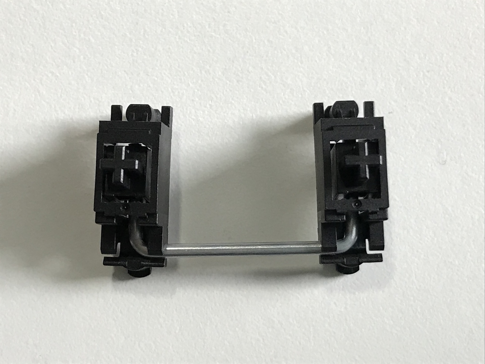

## スタビライザを取り付ける
1. 最下段のキースイッチが挿入される穴の付近には、"2.00"や"2.25"などキーの幅が書かれていますので、取り付けたい位置を確認します。

2. PCBのスタビライザ取付位置には、4つの穴が空いていて、上下のどちらか2つが大きくなっています。大きい穴の方にスタビライザのワイヤ部分が向くように配置し、先に大きい穴の方を差し込み、次に小さい穴の方を差し込みます。
3. 浮きやズレがなく取り付けられているか確認します。

## PCBとトッププレートを組み合わせる
1. PCBとトッププレートを組み合わせます。
2. キースイッチをPCBにしっかりと押し込み、底面がPCBから浮いていないか確認します。
3. スタビライザの間にキースイッチを取り付けます。

## キースイッチをはんだ付けする
1. キースイッチをはんだ付けします。最下段のキースイッチはプレートに固定されていないため、マスキングテープなどで固定した方が作業しやすいかもしれません。

## バックライト用LEDをはんだ付けする（オプション）
1. バックライト用LEDを取り付けます。LEDには向きがあります。リードの長いほうがプラス（＋）、短い方が（ー）に差し込まれていることを確認してください。
2. 最下段のLEDは、選択したキーの幅によって使用する穴の位置が異なります。また使用する位置によっては、極性も異なりますので、注意してください。スイッチの真ん中のピンが挿入される穴の真下にある＋／ーのペアを使用します。

## アンダーグロウ用LEDテープを取り付ける
1. LEDテープをハンダ付けします。

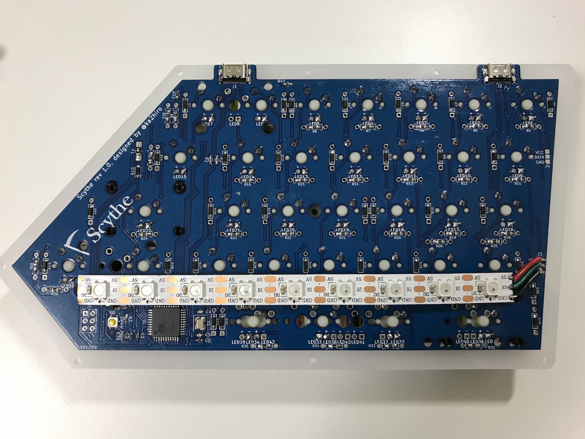

## ケースを組み立てる
1. ボトムプレートには左右があります。リセット用の穴の形が四角い方が左手用で、丸い方が右手用です。ミドルプレートにも左右があります。内側にRがついて角が丸くなっている部分がある方が右手用で、無い方が左手用です。
2. M2x5mmネジをボトムプレートに差し込み、スペーサを取り付けます。
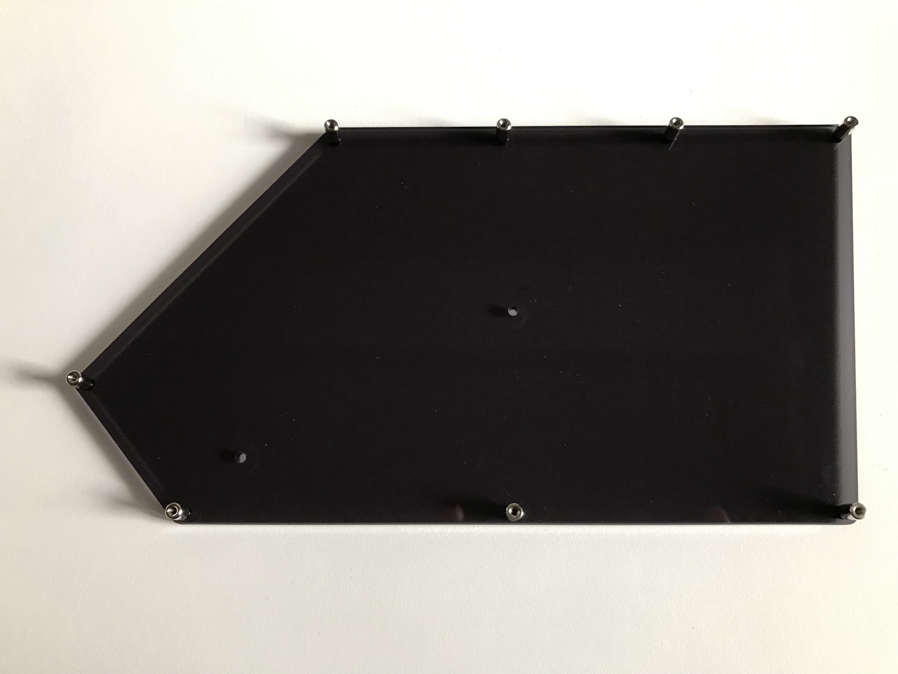
3. ミドルプレートのスペーサ用の穴とスペーサの位置を合わせ、ボトムプレートにミドルプレートを重ねます。_ミドルプレートは非常に折れやすいので、取扱には注意してください。_

4. トッププレートをミドルプレートに重ねて、M2x5mmネジで締め付けます。
5. トッププレートとボトムプレートに中央にもネジ留めできる穴がありますので、打鍵感の好みに合わせて、必要であれば取り付けてください。

## ゴム足をつける
1. ゴム足をボトムプレートにつけます。ゴム足には大小ありますので、お好みで取り付けてください。

## キーキャップをつける
1. お好みのキーキャップを取り付けます。

## ファームウェアを書き込む
ファームウェアはQMKを利用します。以下のリポジトリをクローンしてください。

[qmk_firmware](https://github.com/qmk/qmk_firmware)

クローンしたら、ローカルリポジトリのディレクトリへ移動し、以下のコマンドを実行すると、ファームウェアを書き込むために待機状態になりますので、キーボードを接続してください。すでにキーボードが接続されている場合は、そのまま書き込みが始まります。

~~~
$ make scythe:default:dfu
~~~

初めてファームウェアを書き込む場合は、リセットスイッチを押す必要はありません。

ファームウェアをビルドする環境の構築は、[こちらのドキュメント](https://docs.qmk.fm/#/getting_started_build_tools)を参考にしてください。

## 完成！
これで完成です。おつかれさまでした。
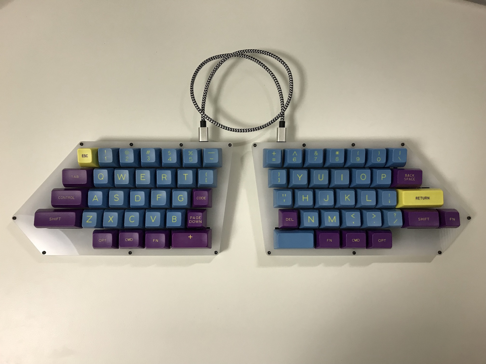

