# Scythe build guide

## Before build
* Please be aware of injuries with soldering irons, tools, parts etc.
* When you leave your seat during work, please confirm that the soldering iron is turned off.
* Very small parts are included, so be careful not to lose.

## Confirm contents
The following parts are included in the kit. Please check whether there is any shortage before work.

Number | Name | Value | Qty | Remarks | Place(Left hand) | Place(Right hand) 
:----|:--------|:-----|:----|:-----------------|:-------|:-------
1  | PCB |       | 2    | 1 for left hand, 1 for right hand         | |
2  | Capacitor | 1μF | 5 | 1 spare, colored with blue marker. | C1, C2 | C1, C2 |
3  | Resistor | 22Ω | 5 | 1 spare, colored with yellow marker, marked "220" on the package. | R3, R4 | R1, R2 |
4  | Registor | 10kΩ | 5 | 1 spare, colored with green marker, marked "103" on the package. | R5, R38 | R3, R38 |
5  | Registor | 5.1kΩ | 5| 1 spare, colored with purple marker, marked "512" on the package. | R1, R2 | R41, R42 |
6  | Capacitor | 22pF | 5 | 1 spare, colored with red marker. | C4, C5 | C4, C5 |
7  | Capacitor | 0.1μF | 3 | 1 spare, no marker. | C3 | C3 |
8  | Crystal oscillator | FA238-16MHz | 2 | | Y1 | Y1 |
9  | Shottky diode | RB160M-30TR | 2 | | D33 | D76 | 
10 | Tact switch | TVAF17-WEC-R | 2 | | SW41 | SW44 | 
11 | Resettable fuse | nanoSMDC050F/13.2 | 2 | | F1 | F1 |
12  | MPU | ATMEGA32U4-AU | 2 | | U1 | U1 |
13  | USB connector | Type-C Female | 4 | | J1, J2 | J1, J2 |
14 | Diode | 1N4148W | 66 | | D1 - D32 | D1 - D33 |
15 | Stabilizer housing | | 12 | |
16 | Stabilizer support bracket | | 12 | |
17 | Stabilizer wire | | 6 | |
18 | Top plate | | 2 |  |
19 | Bottom plate | | 2 | |
20 | Middle plate | | 4 | |
21 | M2 Standoff | 6mm | 18 | |
22 | M2 screw | 5mm | 36 | |
23 | Rubber feet (small) | | 10 | |
24 | Rubber feet (large) | | 4 | |
25 | USB Type-C cable  |       | 1 | Connect between left and right. |
26 | Registor | 1kΩ | 3 | Option for backlight, 1 spare, colored with brown marker, marked "102" on the package. | R39 | R37 |
27 | FET  | IRLML6344TRPBFTR | 3 | Option for backlight. | Q1 | Q1 |

## Other required items
In order to complete the kit, the following parts must be prepared separately.

* Key switch (Cherry MX compatible only support. Low-profile type is not supported)
* Key caps
* USB Micro B cable (for connection with PC)

When installing the optional backlight, the following parts must be prepared separately.

* Resistance 470Ω x 65 (smaller body (<= 2mm) for lead components, 2012 or 1608 (mm) for surface mount components)
* 3mm LED x 65

When installing the optional underglow, the following parts must be prepared separately.

* WS2812B LED tape

## Required tools
In order to build, the following tools are required at minimum.

* Soldering iron (preferred temperature controllable)
* Lead solder
* Tweezers
* Phillips head screwdriver
* Magnifier
* Flux
* Multimeter

In addition, you may also prepare the following as necessary.

* Flux remover
* Solder wick

## Solder MPUs
1. Place the ● mark (pin 1 marking) on the MPU aligned with the ○ mark on the board.
2. Make sure that all pins are on the pad and solder them.

For the QFP package soldering, this [movie] (https://www.youtube.com/watch?v=-8SRkSjkZ8A) may be helpful.

## Solder crystal oscilators
1. Align the long side of the crystal oscillator (which may be either long side) so that it comes to the position of the part number (Y1) on the board and place it at the center of the four pads.
2. Since the terminal can be seen only a little at the corner of the crystal oscillator, solder is poured while warming it at the tip of the crystal.

This [movie] (https://www.youtube.com/watch?v=14fJTgFg03M) may be helpful for soldering SMD crystal oscillator.

## Solder resistors
1. Resistors(R1-R5 and R38 for left, R1-R3, R37, R38, R41 and R42 for right) are really small so they lose sight of it quickly. When soldering, remove them one at a time from the tape.

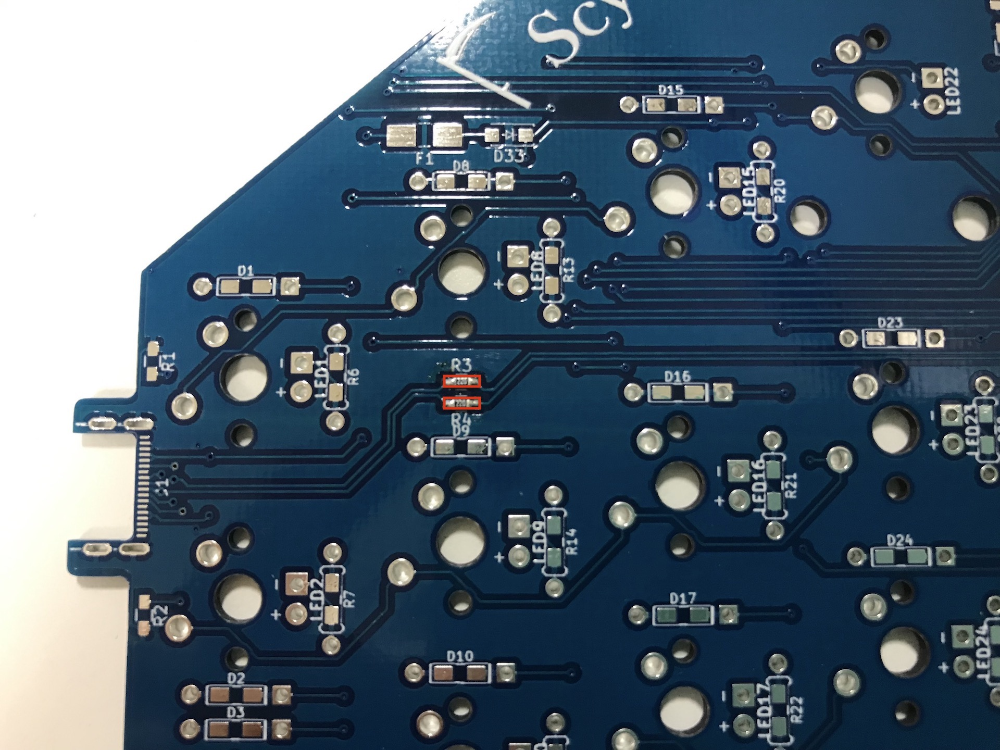

## Solder capacitors
1. Since capacitors(C1-C5) are not written with numbers or letters on the parts themselves, it is impossible to distinguish them by looking at things with different values, so be careful.

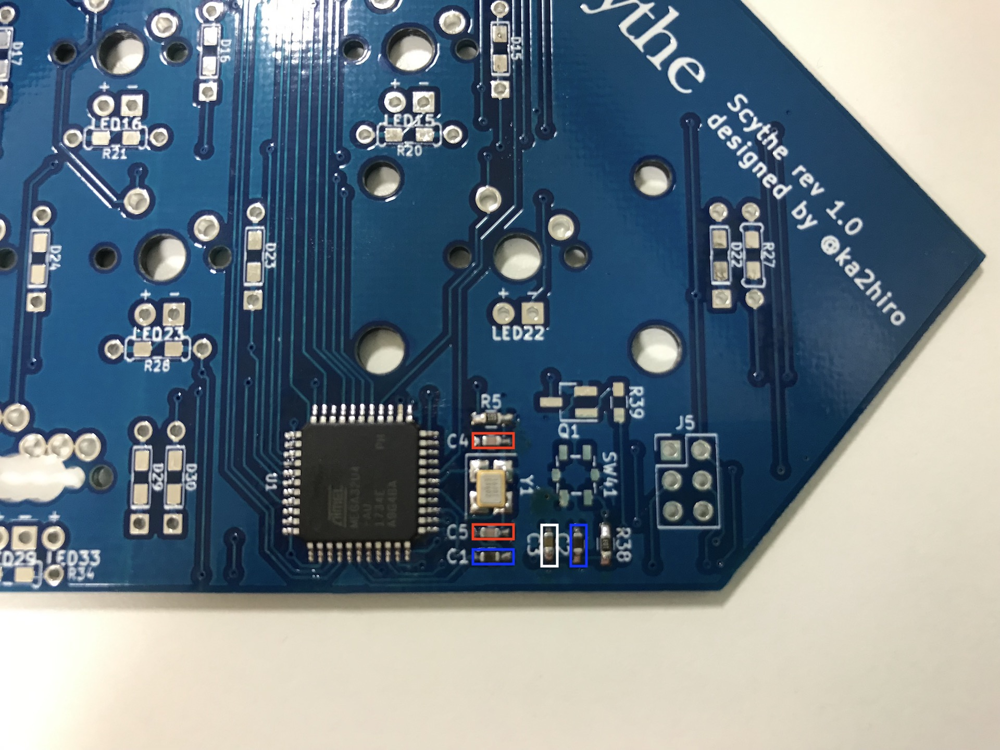

## Solder schottky diodes
1. The diode(D33 for left, D79 for right) has a mounting orientation. Align the part of one side of the package that is painted white and bandlike to the position of the vertical bar of the diode symbol on the board.

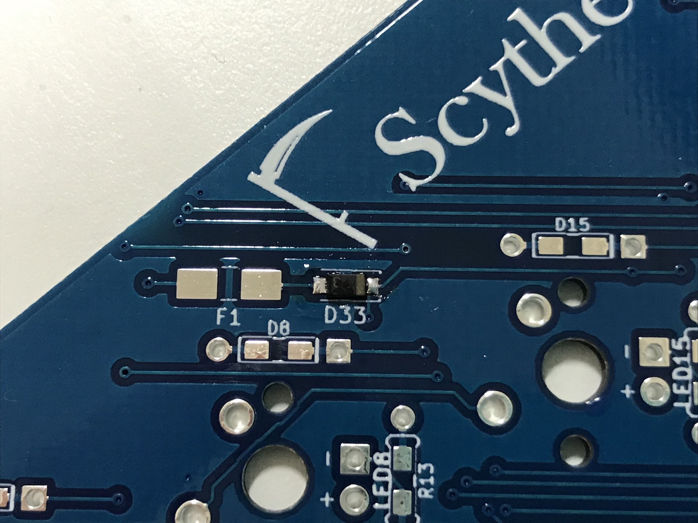

## Solder resettable fuse
1. Solder the resettable fuse F1.

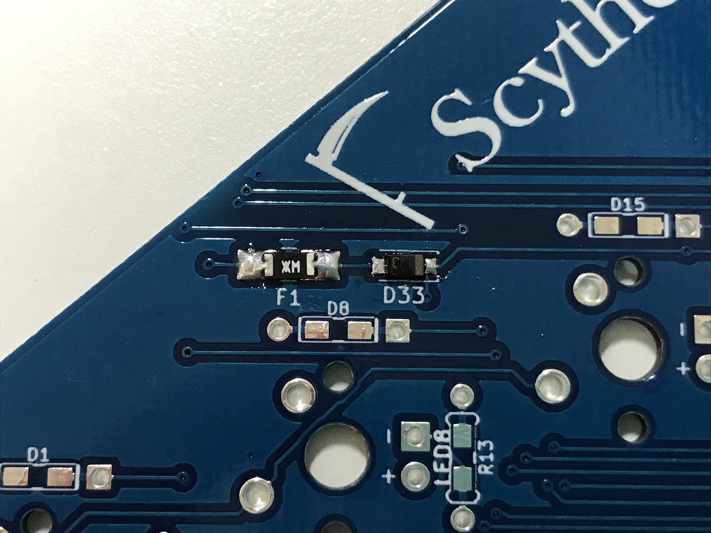

## Solder USB connectors
1. If soldering from the pin part first rather than the outer through hole part, it can be installed without misalignment.

## Solder tact switches
1. Since the tactile switch has a little metallic part on the side, apply a soldering iron to that part and let the solder flow.

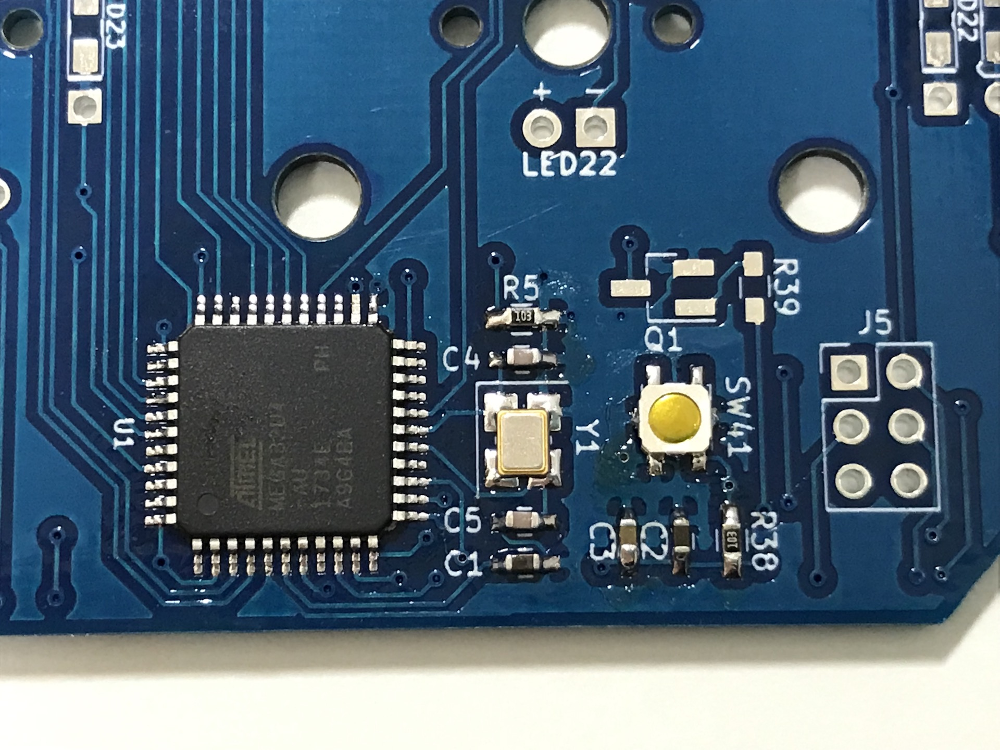

## Solder diodes
1. The diodes(D1-D32 for right, D1-D33 for left) has a mounting orientation. Align the part of one side of the package that is painted white and bandlike to the position of the vertical bar of the diode symbol on the board.

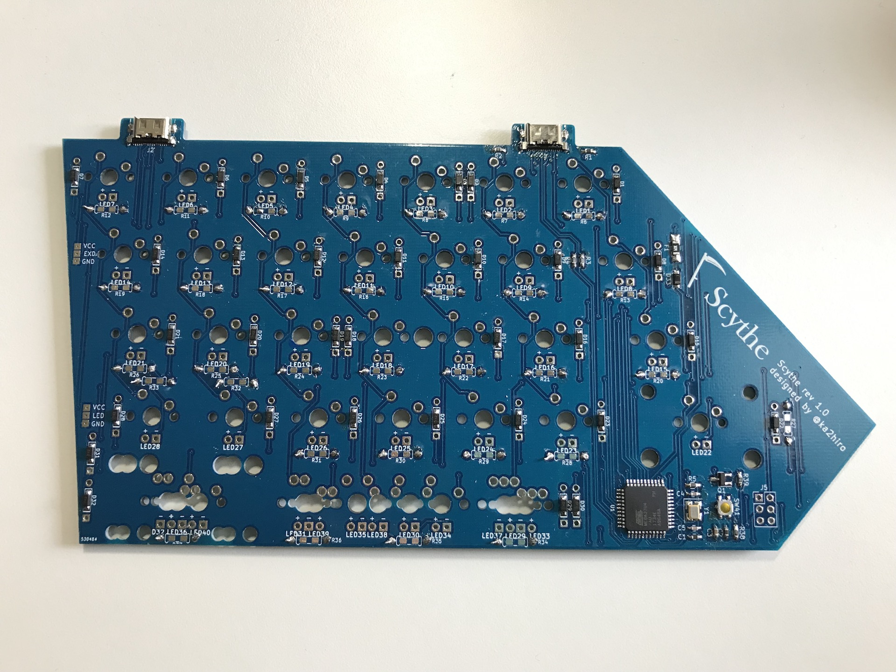

## Solder FET for backlight (optional)
1. Solder the FET Q1.
2. Solder the resistors (R39 for left, R37 for right) located next to the FET.

## Solder resistors for backlight (optional)
1. Solder 470Ω resistors (R6 to R37 for left, R4 to R36 for right). For surface mount type resistors, solder to the back surface (solder surface), and for through hole type resistors, solder to the front surface (switch mounting surface).

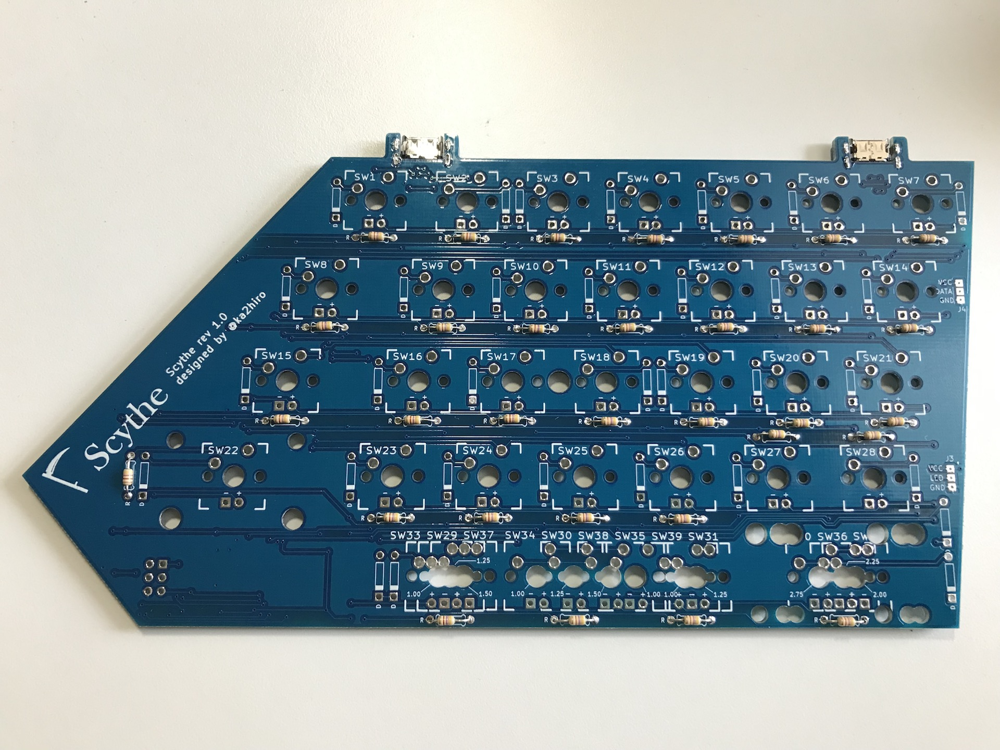

## Check whether the soldering is properly done
Refer to the schematic ([left side](files/scythe_left.pdf), [right side](files/scythe_right.pdf)) and check whether soldering is correctly done.

Before connecting to the computer, at least check the followings.

1. Check that there is no short circuit between UVCC - GND and VCC - GND.
2. Make sure the MPU pins are not bridged.
3. Make sure the USB connector pins are not bridged.

## Verify that it is recognized as a USB device
Connect the keyboard to the computer and confirm that it is recognized as a USB device.

* For Mac, start "System Information" and check whether the device named "ATm32U4DFU" is visible.

* For Windows, I have not tried it because I do not have the environment at hand, but it seems to appear as "ATm32U4DFU" in the device manager.

If it is not recognized as a USB device, please double check the schematic to see if all parts are properly soldered.

For Windows, the driver may not be installed. Download the driver from the link below, install it, and check again.

[Driver for Windows](https://gallery.microchip.com/packages/Atmel-USB-Installer-7.0/1.0.0)

## Select key layout
1. The layout can be selected from multiple patterns for the key switch on the bottom row, the right on the top row on the right hand side, and the right on the fourth row on the right hand side. Depending on which pattern is selected, the key switch and stabilizer mounting position will change, so select the pattern in advance.

## Attach the key switches to the top plate
1. Attach the key switches to the top plate.
2. For the bottom row, the right side of the top row on the right hand side, and the right side of the 4th row on the right hand side, attach the key switches after combining the top plate and PCB.

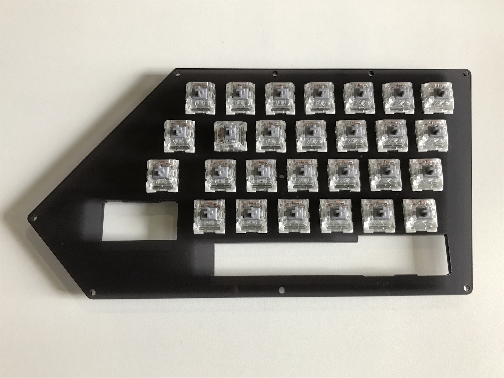

## Assemble the stabilizers
1. The stabilizer shaft has two hole sides (right side of the photo) and one hole side (left side of the photo). The wire is inserted into the lower hole on the 2 hole side.
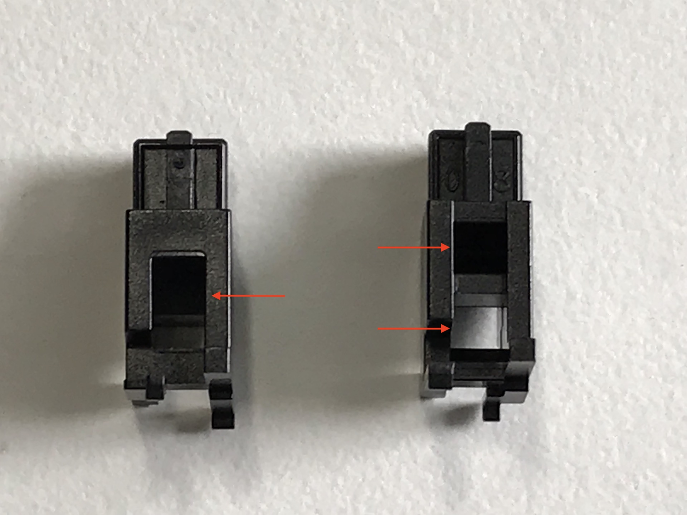

2. The stabilizer shaft has a wire attachment part.


3. First, align the 2-hole side of the stabilizer shaft with the wire mounting part of the stabilizer pedestal, and then insert the shaft from the bottom of the pedestal.



4. Insert one side of the wire into the lower hole in the shaft.


5. When viewing the pedestal from the side, tilt the wire 90 degrees toward you and snap it into the pedestal wire holder.

6. Repeat the above steps for the other side.

## Install the stabilizer
1. The width of the key such as "2.00" or "2.25" is written near the hole where the bottom key switches are inserted. Check the position where you want to install the stabilizer.

2. On the PCB, there are four holes each in the position where the stabilizer is installed, and two of the four holes are larger. Align the stabilizer wire with the larger hole, insert the stabilizer into the larger hole, and then insert the smaller hole.

3. Check that it is installed without floating or misalignment.
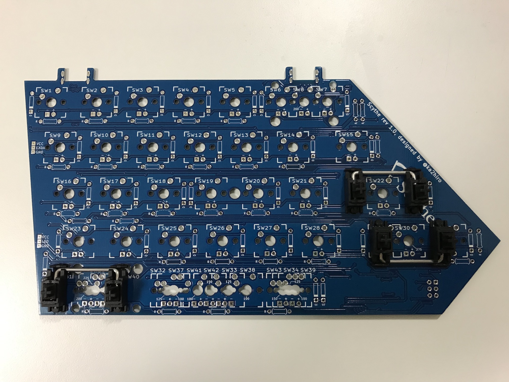

## Combine PCB and top plate
1. Combine the PCB and top plate.
2. Press the key switches firmly into the PCB and check that the bottom of the key switches are in contact with the PCB.
3. Install the key switches at the stabilizer locations.

## Solder key switches
1. Solder the key switches. Since the bottom key switches are not fixed to the plate, it may be easier to work with masking tape.

## Solder LED for backlight (optional)
1. Install the backlight LEDs. The LED has a direction. Make sure that the longer lead is inserted into the plus (+) and the shorter one into the (-).
2. The position of the hole used for the bottom row LED depends on the selected key width. Also note that the polarity varies depending on the position of the hole used. Use the +/- pair just below the hole where the middle pin of the switch is inserted.

## Solder the LED tape for underglow
1. Solder the LED tape.
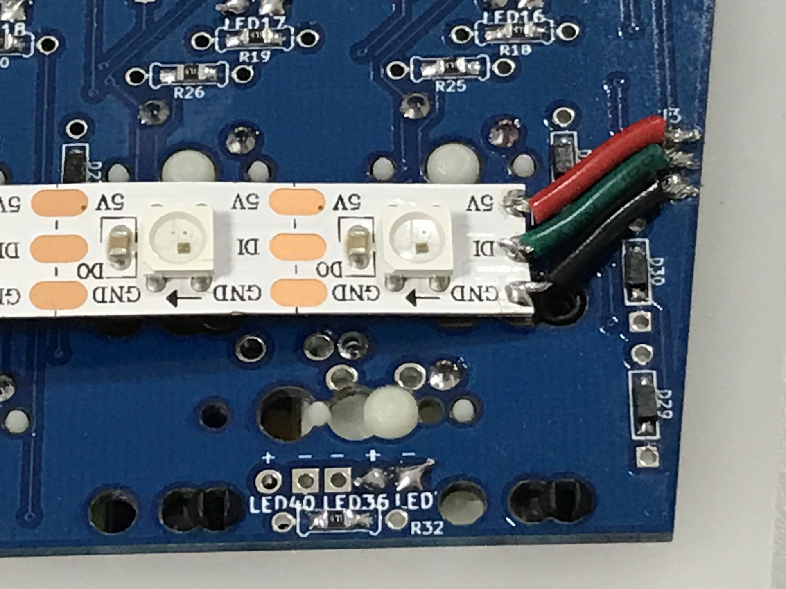

## Assemble the case
1. The bottom plate is different for left hand and right hand. The reset hole is square for the left hand and round for the right hand. The middle plate is also different for left hand and right hand. The one with the rounded corners on the inside of the plate is for the right hand, and the one without the round is for the left hand.

2. Insert the M2x5mm screw into the bottom plate and attach the spacer.

3. Align the spacer holes on the middle plate with the spacers attached to the bottom plate, and overlay the middle plate on the bottom plate. _Be careful when handling the middle plate because it is very easy to break._
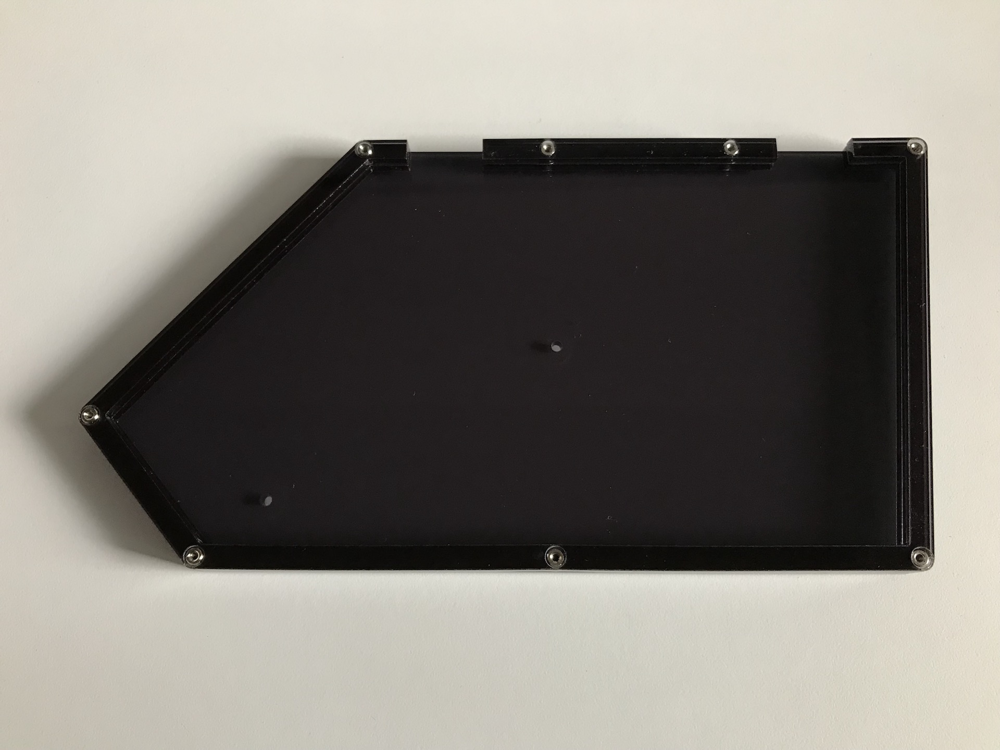

4. Place the top plate on the middle plate and tighten with M2x5mm screws.

5. The top and bottom plates also have a hole that can be screwed to the center. Screw it if necessary.

## Attaching rubber feet
1. Attach the rubber feet to the bottom plate. There are large and small rubber feet, please attach as you like.
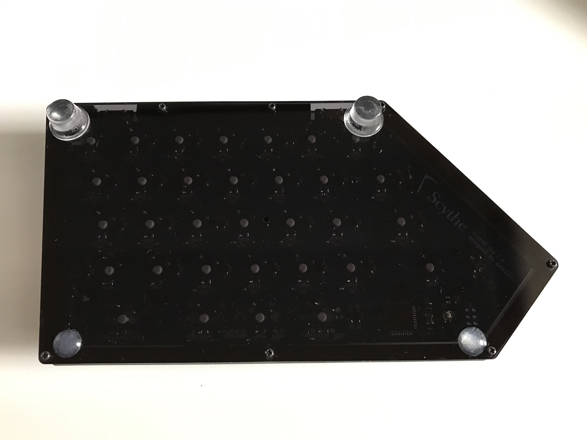

## Attach the key caps
1. Attach your favorite keycaps.

## Write firmware
The firmware uses QMK. Please clone the following repository.

[qmk_firmware](https://github.com/qmk/qmk_firmware)

After cloning, move to the directory of the local repository and execute the following command, the standby state will be entered to write the firmware, please connect the keyboard. If the keyboard is already connected, writing will begin.

~~~
$ make scythe:default:dfu
~~~

It is not necessary to press the reset switch to write the firmware for the first time.

Please refer to [this document](https://docs.qmk.fm/#/getting_started_build_tools) for building the environment for building firmware.

## Completed!
Congratulation!

